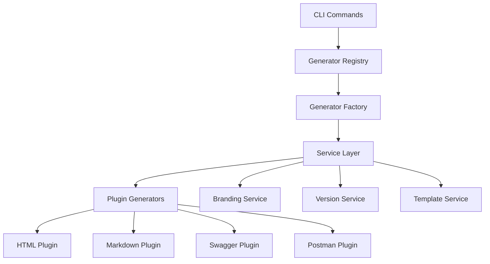

# Confytome Documentation Index

**Plugin-based API documentation generator** with OpenAPI-first architecture and extensible generator registry system.

## 📋 Quick Navigation

### 🚀 Getting Started
- [**README.md**](./README.md) - Main project overview, installation, and quick start
- [**packages/core/templates/README.md**](./packages/core/templates/README.md) - Project templates and plugin system usage

### 🔌 Plugin System
- [**PLUGIN-SYSTEM.md**](./PLUGIN-SYSTEM.md) - Comprehensive plugin development guide
- [**CONTRIBUTING.md**](./CONTRIBUTING.md) - Contributing guidelines with plugin focus
- [**packages/core/services/**](./packages/core/services/) - Service layer documentation

### 🛠️ Development
- [**CLAUDE.md**](./CLAUDE.md) - Development notes and architecture overview
- [**CHANGELOG.md**](./CHANGELOG.md) - Version history and release notes

### 🔒 Security & Operations
- [**SECURITY.md**](./SECURITY.md) - Security policy and plugin system considerations

## 📦 Package Documentation

### Core System
| Package | Purpose | Documentation |
|---------|---------|---------------|
| **@confytome/core** | Plugin registry, service layer, CLI | [packages/core/README.md](./packages/core/README.md) |

### Generator Plugins
| Package | Format | Documentation |
|---------|--------|---------------|
| **@confytome/markdown** | Confluence-friendly Markdown | [packages/markdown/README.md](./packages/markdown/README.md) |
| **@confytome/swagger** | Interactive Swagger UI | [packages/swagger/README.md](./packages/swagger/README.md) |
| **@confytome/html** | Professional HTML docs | [packages/html/README.md](./packages/html/README.md) |
| **@confytome/postman** | Postman collections | [packages/postman/README.md](./packages/postman/README.md) |

## 🎯 Use Case Documentation

### For Users
1. **Getting Started**: [README.md](./README.md) - Installation and first steps
2. **Project Setup**: [templates/README.md](./packages/core/templates/README.md) - Configuration examples
3. **Plugin Management**: Run `confytome generators` and `confytome info <plugin>`

### For Plugin Developers
1. **Plugin System Overview**: [PLUGIN-SYSTEM.md](./PLUGIN-SYSTEM.md) - Architecture and patterns
2. **Contributing Guidelines**: [CONTRIBUTING.md](./CONTRIBUTING.md) - Development workflow
3. **Base Classes**: [packages/core/utils/base-generator.js](./packages/core/utils/base-generator.js)
4. **Service Layer**: [packages/core/services/](./packages/core/services/)

### For Contributors
1. **Architecture**: [CLAUDE.md](./CLAUDE.md) - System design and plugin patterns
2. **Contributing**: [CONTRIBUTING.md](./CONTRIBUTING.md) - Code guidelines and testing
3. **Security**: [SECURITY.md](./SECURITY.md) - Security considerations

## 🔍 Key Concepts

### Plugin System Architecture


### Documentation Flow
1. **OpenAPI Generation**: `confytome openapi` creates specification
2. **Plugin Discovery**: Registry finds workspace and external plugins
3. **Service Injection**: Plugins receive shared services (branding, versioning)
4. **Document Generation**: Plugins consume OpenAPI spec and generate output

### Plugin Types
- **Workspace Generators**: Located in `packages/` (internal, trusted)
- **External Plugins**: npm packages following `confytome-plugin-*` pattern
- **Spec Consumers**: Generate documentation from OpenAPI specs
- **Spec Generators**: Create OpenAPI specifications from JSDoc

## 🏗️ Architecture Documentation

### Core Components
- **GeneratorRegistry** ([services/GeneratorRegistry.js](./packages/core/services/GeneratorRegistry.js)): Plugin discovery and management
- **GeneratorFactory** ([services/GeneratorFactory.js](./packages/core/services/GeneratorFactory.js)): Plugin instantiation with DI
- **ServiceFactory** ([services/ServiceFactory.js](./packages/core/services/ServiceFactory.js)): Service layer management
- **RegistryOrchestrator** ([services/RegistryOrchestrator.js](./packages/core/services/RegistryOrchestrator.js)): High-level plugin operations

### Base Classes
- **BaseGenerator** ([utils/base-generator.js](./packages/core/utils/base-generator.js)): Common generator functionality
- **SpecConsumerGeneratorBase**: Template for OpenAPI spec consumers
- **PluginInterface** ([services/PluginInterface.js](./packages/core/services/PluginInterface.js)): External plugin development utilities

## 📄 Configuration Files

### Project Configuration
- **confytome.json** - Simplified project configuration for plugin system
- **serverConfig.json** - OpenAPI server configuration and metadata

### Template Files
- [**packages/core/templates/**](./packages/core/templates/) - Project initialization templates
  - `confytome.template.json` - Plugin system configuration template
  - `serverConfig.template.json` - OpenAPI configuration template
  - `example-router.js` - JSDoc examples
  - `example-auth-routes.js` - Server override examples

## 🧪 Testing Documentation

### Test Structure
```
packages/core/tests/
├── unit/              # Unit tests for core components
├── integration/       # Integration tests for plugin system
└── fixtures/          # Test data and mock plugins
```

### Running Tests
```bash
# Core system tests
npm run test:core

# Security audit
npm run security:check

# Plugin validation
confytome validate
```

## 📚 External Resources

### Standards & Specifications
- [OpenAPI 3.0.3 Specification](https://spec.openapis.org/oas/v3.0.3)
- [JSDoc Documentation](https://jsdoc.app/)
- [Swagger JSDoc Integration](https://github.com/Surnet/swagger-jsdoc)

### Related Tools
- [Mustache](https://mustache.github.io/) - Logic-less templates (used for markdown generation)
- [Swagger UI](https://swagger.io/tools/swagger-ui/) - Interactive documentation
- [Postman Collections](https://learning.postman.com/docs/collections/collections-overview/) - API testing

---

**🔧 Need Help?**
- Run `confytome --help` for CLI assistance
- Run `confytome generators` to list available plugins
- Run `confytome info <plugin>` for detailed plugin information
- Check [Issues](https://github.com/n-ae/confytome/issues) for known problems
- Review [Contributing Guidelines](./CONTRIBUTING.md) for development setup

**Last Updated**: 2025-09-05 | **Plugin System Version**: 1.2.0